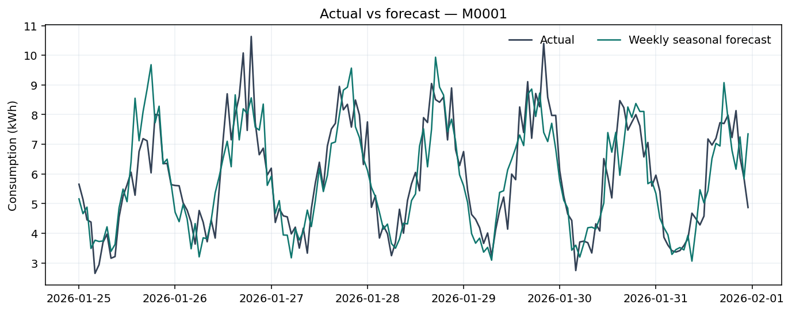
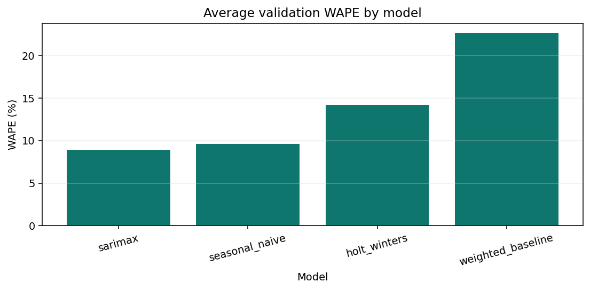
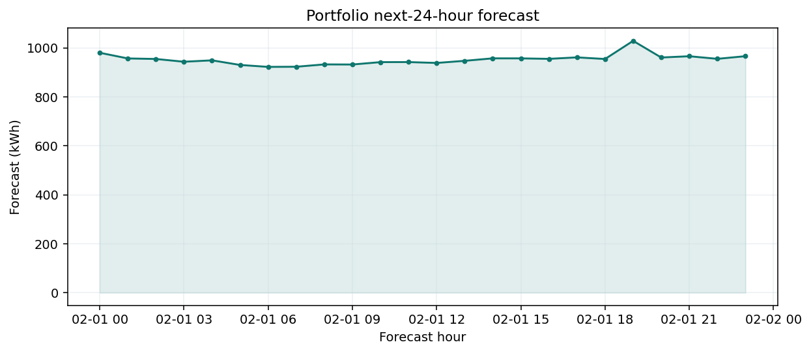
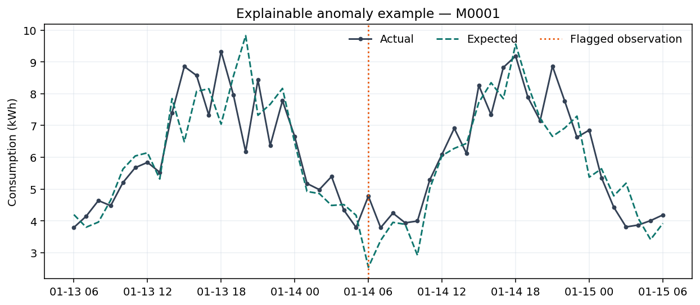

[](https://github.com/mertcanakdogan/energy-demand-forecasting-pipeline/actions/workflows/tests.yml)

# Production-Style Energy Demand Forecasting Pipeline

End-to-end hourly electricity-demand forecasting with rolling backtesting, automatic model selection, anomaly detection and reproducible synthetic data.

## Project overview

This portfolio project turns a business forecasting question into a reproducible Python workflow rather than a notebook-only analysis. It creates an entirely fictional smart-meter portfolio, audits and prepares the readings, evaluates four understandable forecasting methods for every meter, chooses the best valid model per meter, and produces decision-ready meter, customer-group, and total-portfolio outputs.

The default configuration models **100 synthetic meters across 12 customer groups and 13 months of hourly history**. The code is modular, typed where it improves clarity, covered by behavioural tests, and runnable locally without credentials, services, or downloaded data.

> **Independent implementation disclaimer:** This project is an independent portfolio implementation built entirely with synthetic data. It does not contain employer data, employer source code, customer information, proprietary trading logic, or confidential business rules.

## Business problem

A fictional electricity retailer needs a next-day view of demand across heterogeneous smart meters. Each meter has its own scale, intraday profile, weekday/weekend behaviour, annual pattern, temperature response, and noise. Readings can also arrive late, appear twice, or contain abnormal spikes and drops.

The analytical workflow answers four practical questions:

1. Is the source data fit for modelling, and what was repaired?
2. Which forecasting method has performed best for each meter in recent historical simulations?
3. What is the expected demand for each of the next 24 hours at meter, group, and portfolio level?
4. Which observations differ enough from an explainable expectation to warrant review?

This is deliberately described as **production-style**, not production. It demonstrates maintainable analytical engineering without claiming to operate a live energy system.

## Architecture

```text
Synthetic Data
      ↓
Validation
      ↓
Missing/Duplicate Handling
      ↓
Feature Engineering
      ↓
Rolling Backtesting
      ↓
Model Comparison
      ↓
Best Model per Meter
      ↓
24-Hour Forecast
      ↓
Group & Portfolio Aggregation
      ↓
Anomaly Detection
```

Responsibilities stay intentionally small: pandas DataFrames are the explicit boundary between stages, models expose one forecast method, and the pipeline module only coordinates I/O and workflow order. There are no external APIs, databases, hidden global state, or network dependencies.

## Synthetic data design

`synthetic_data.py` uses NumPy's seeded random generator, so identical configuration produces identical data. Each meter receives independently sampled characteristics:

- base demand and meter scale;
- hourly and annual seasonality;
- weekday/weekend and fixed fictional holiday effects;
- optional temperature sensitivity;
- proportional random noise;
- artificial positive spikes and consumption drops;
- deliberately omitted readings and duplicated meter/timestamp rows.

The raw schema is:

| Field | Meaning |
|---|---|
| `meter_id` | Fictional meter identifier |
| `group_id` | Fictional customer-group identifier |
| `timestamp` | Hourly observation time |
| `consumption_kwh` | Synthetic interval consumption |
| `temperature_c` | Synthetic ambient temperature |
| `is_weekend` | Calendar weekend flag |
| `is_holiday` | Fixed fictional holiday flag |

The full generated CSV is written to `data/generated/` and ignored by Git. A compact, deterministic three-meter example is committed at `data/sample/synthetic_meter_sample.csv`.

## Data quality and feature engineering

Validation returns structured issue codes and readable messages for:

- missing or unexpected columns;
- duplicate meter/timestamp keys;
- missing hourly timestamps;
- negative or non-numeric consumption;
- invalid meter or group identifiers;
- unparseable timestamps;
- temperatures outside the generic `-60°C` to `60°C` plausibility range.

The pipeline first saves the raw validation report, then performs a separate preparation step. Duplicates are averaged, missing hours are reindexed and interpolated, and repaired rows retain a `was_missing` flag. Unsafe values such as negative consumption are rejected rather than silently corrected.

Calendar feature engineering adds hour, day of week, month, and cyclical daily/weekly encodings. The SARIMAX adapter uses equivalent daily and weekly Fourier regressors directly during multi-step forecasting.

## Forecasting models

| Model | Purpose | Main behaviour |
|---|---|---|
| Seasonal Naive | Safe, transparent fallback | Uses the same hour from the previous week |
| Weighted Baseline | Responsive recent-history benchmark | Repeats a recent 24-hour profile scaled by an exponentially weighted level |
| Holt-Winters | Classical trend/seasonality model | Additive damped trend with 24-hour seasonality |
| SARIMAX | Autoregressive statistical model | AR(1) errors plus daily and weekly Fourier regressors |

All adapters return finite, non-negative forecasts and share a minimal interface. A failure in one model/meter fit is recorded without aborting other evaluations.

## Backtesting methodology

The evaluator uses chronological rolling origins:

```text
bounded training history → forecast next 24 hours → score → advance origin → repeat
```

Training timestamps must precede validation timestamps, preventing future leakage. The default demo uses two validation folds, each with a 24-hour forecast horizon and a maximum of eight recent weeks for each fit. These settings keep all 800 model/fold combinations understandable and runnable on a normal laptop.

Two metrics are calculated on aligned, finite actual/forecast pairs:

- **MAE:** average absolute error in kWh.
- **WAPE:** total absolute error divided by total absolute actual demand.

If there are no valid pairs, a metric is `NaN`. WAPE is also `NaN` when the absolute actual-demand denominator is zero; it never returns infinity or conceals the undefined case.

## Model selection

For each meter, valid fold metrics are averaged by model. The candidate with the lowest mean WAPE is selected, with mean MAE retained as a supporting measure. Ties are deterministic. A meter falls back to seasonal naive when history is insufficient, required folds are invalid, or all candidate fits fail.

`model_selection.csv` therefore provides an auditable row per meter:

```text
meter_id, selected_model, wape, mae, number_of_folds, selection_reason
```

The selected model is fitted on recent available history to generate exactly 24 future hourly values. `group_forecast.csv` and `portfolio_forecast.csv` reconcile directly to the meter-level output.

## Anomaly detection

The detector compares each actual reading with the corresponding hour from the previous week. Generic, configurable signed-deviation thresholds identify:

- `positive_spike` — actual demand materially above expectation;
- `negative_drop` — actual demand materially below expectation;
- `missing_reading` — the raw hourly observation was absent.

Outputs include actual, expected, percentage deviation, type, and severity. The method is intentionally explainable and illustrative; it is not a proprietary or domain-optimised anomaly model.

## Example results

The committed outputs were generated by `config/default.yaml` with seed `42`. They are descriptive results from this synthetic scenario, not claims about real-world forecasting performance.

| Result | Generated value |
|---|---:|
| Prepared history | 950,400 meter-hours |
| Historical range | 2025-01-01 to 2026-01-31 |
| Backtest evaluations | 800 (100 meters × 4 models × 2 folds) |
| Mean WAPE of each meter's selected model | 7.86% |
| Mean MAE of each meter's selected model | 0.743 kWh |
| Next-24-hour portfolio forecast | 22,856.4 kWh |
| Flagged anomaly records | 3,290 |
| Full local pipeline runtime | approximately 103 seconds on the generating machine |

Average validation WAPE across all meter/fold evaluations was 8.94% for SARIMAX, 9.61% for seasonal naive, 14.16% for Holt-Winters, and 22.68% for the weighted baseline. Per-meter selection chose SARIMAX for 60 meters, seasonal naive for 26, Holt-Winters for 13, and the weighted baseline for 1. The variation is expected because meters are intentionally heterogeneous.









CSV details and the machine-readable summary are available under `outputs/examples/`, including `run_metadata.json`.

## Repository structure

```text
energy-demand-forecasting-pipeline/
├── .github/workflows/tests.yml
├── config/default.yaml
├── data/
│   └── sample/synthetic_meter_sample.csv
├── notebooks/01_demo.ipynb
├── outputs/examples/
│   ├── *.csv
│   ├── *.png
│   └── run_metadata.json
├── src/energy_forecasting/
│   ├── models/
│   │   ├── seasonal_naive.py
│   │   ├── weighted_baseline.py
│   │   ├── holt_winters.py
│   │   └── sarimax.py
│   ├── anomaly_detection.py
│   ├── backtesting.py
│   ├── features.py
│   ├── forecasting.py
│   ├── metrics.py
│   ├── model_selection.py
│   ├── pipeline.py
│   ├── synthetic_data.py
│   ├── validation.py
│   └── visualization.py
├── tests/
├── LICENSE
├── pyproject.toml
└── README.md
```

## Installation

Python 3.12 is the supported version.

```bash
git clone <repository-url>
cd energy-demand-forecasting-pipeline
python -m venv .venv
```

Activate the environment:

```bash
# macOS/Linux
source .venv/bin/activate

# Windows PowerShell
.venv\Scripts\Activate.ps1
```

Install the package and development dependencies:

```bash
python -m pip install --upgrade pip
python -m pip install -e ".[dev]"
```

## How to run

Run the complete default demo from the repository root:

```bash
python -m energy_forecasting.pipeline
```

This regenerates the full synthetic data, validates and prepares it, evaluates every configured model for every meter, selects models, forecasts 24 hours, aggregates results, detects anomalies, and refreshes all example CSV/JSON/PNG files.

Generate data only:

```bash
python -m energy_forecasting.synthetic_data
```

Generate a smaller standalone sample:

```bash
python -m energy_forecasting.synthetic_data --meters 3 --groups 3 --months 1 --seed 42 --output data/sample/synthetic_meter_sample.csv
```

The installed console commands `energy-forecast-demo` and `energy-generate-data` provide the same entry points. Change seeds, portfolio dimensions, fold counts, thresholds, and enabled models in `config/default.yaml`.

Key configuration fields are intentionally kept in one readable file:

| Key | Default | Purpose |
|---|---:|---|
| `seed` | `42` | Reproducible random seed |
| `data.n_meters` / `data.n_groups` | `100` / `12` | Portfolio dimensions |
| `data.start` / `data.months` | `2025-01-01` / `13` | Synthetic history range |
| `data.missing_rate` | `0.001` | Proportion of omitted raw readings per meter |
| `data.duplicate_rate` | `0.0002` | Proportion of duplicated raw rows |
| `data.anomaly_rate` | `0.0008` | Proportion of injected spikes/drops per meter |
| `backtest.horizon` | `24` | Validation forecast length |
| `backtest.folds` / `step_hours` | `2` / `168` | Number and spacing of rolling origins |
| `backtest.min_train_hours` / `max_train_hours` | `672` / `1344` | Minimum and capped fit history |
| `models` | four model names | Ordered candidates evaluated for every meter |
| `forecast_horizon` | `24` | Final future forecast length |
| `anomaly.*_threshold` | see YAML | Generic signed-deviation and severity thresholds |
| `output_dir` | `outputs/examples` | Committed demonstration artefacts |
| `generated_data_path` | `data/generated/...` | Full raw data path ignored by Git |

## Testing and CI

Run the behavioural suite:

```bash
python -m pytest
```

Run it with a coverage report:

```bash
python -m pytest --cov=energy_forecasting --cov-report=term-missing
```

The suite covers deterministic generation, schema and continuity errors, metric edge cases, every model's forecast contract, leakage-safe folds, failure isolation, fallback selection, aggregation reconciliation, anomaly labels, chart creation, and reproducible end-to-end execution. Tests use only temporary synthetic fixtures and require no external services.

GitHub Actions runs the package installation and pytest coverage command on Python 3.12 for every push and pull request.

## Limitations

- Synthetic patterns are useful for demonstrating engineering behaviour but cannot represent every real portfolio.
- Temperature is generated rather than supplied by a weather forecast, so future weather uncertainty is not modelled.
- The two-fold default backtest is a runtime-conscious demonstration, not an exhaustive model-risk study.
- Forecasts are point estimates; prediction intervals and probabilistic calibration are not included.
- The anomaly detector uses generic thresholds and a weekly expectation; flagged records still require analytical review.
- Processing is in-memory and sequential. It is appropriate for this portfolio scale, not a claim of distributed production readiness.
- There is no market bidding, settlement, customer system, or commercial decision logic.

## Future improvements

- Add calibrated prediction intervals and coverage diagnostics.
- Introduce synthetic future-temperature scenarios and temperature-aware forecast evaluation.
- Compare more rolling origins and seasonal regimes through an optional extended-run configuration.
- Parallelise independent meter evaluations after profiling the sequential baseline.
- Add data-drift summaries and model-selection stability reporting.
- Store large optional runs in Parquet while retaining small CSV examples for accessibility.

## License

Released under the [MIT License](LICENSE).
